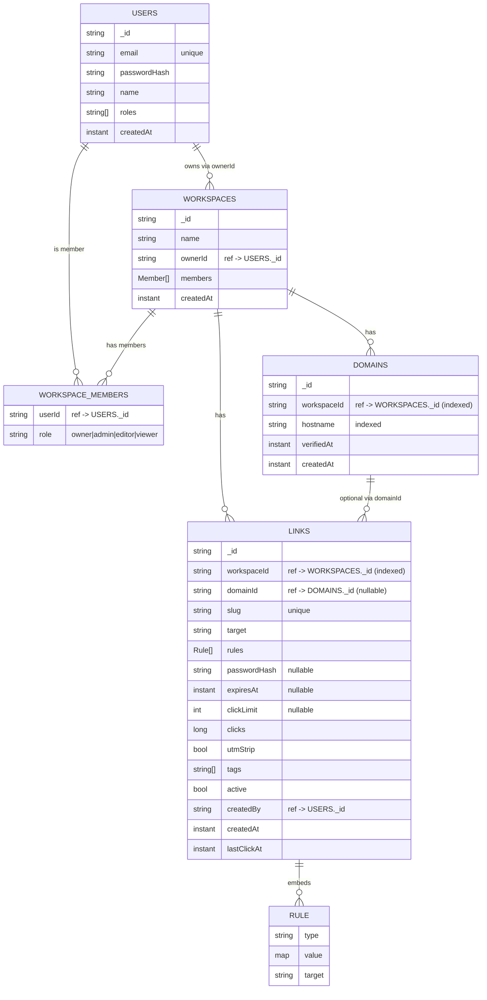

```mermaid
erDiagram
    USERS {
      string _id
      string email  "unique"
      string passwordHash
      string name
      string[] roles
      instant createdAt
    }

    WORKSPACES {
      string _id
      string name
      string ownerId  "ref -> USERS._id"
      Member[] members
      instant createdAt
    }

    WORKSPACE_MEMBERS {
      string userId   "ref -> USERS._id"
      string role     "owner|admin|editor|viewer"
    }

    DOMAINS {
      string _id
      string workspaceId  "ref -> WORKSPACES._id (indexed)"
      string hostname     "indexed"
      instant verifiedAt
      instant createdAt
    }

    LINKS {
      string _id
      string workspaceId  "ref -> WORKSPACES._id (indexed)"
      string domainId     "ref -> DOMAINS._id (nullable)"
      string slug         "unique"
      string target
      Rule[] rules
      string passwordHash "nullable"
      instant expiresAt   "nullable"
      int clickLimit      "nullable"
      long clicks
      bool utmStrip
      string[] tags
      bool active
      string createdBy    "ref -> USERS._id"
      instant createdAt
      instant lastClickAt
    }

    RULE {
      string type
      map    value
      string target
    }

    USERS ||--o{ WORKSPACES : "owns via ownerId"
    USERS ||--o{ WORKSPACE_MEMBERS : "is member"
    WORKSPACES ||--o{ WORKSPACE_MEMBERS : "has members"
    WORKSPACES ||--o{ DOMAINS : "has"
    WORKSPACES ||--o{ LINKS : "has"
    DOMAINS ||--o{ LINKS : "optional via domainId"
    LINKS ||--o{ RULE : "embeds"
```