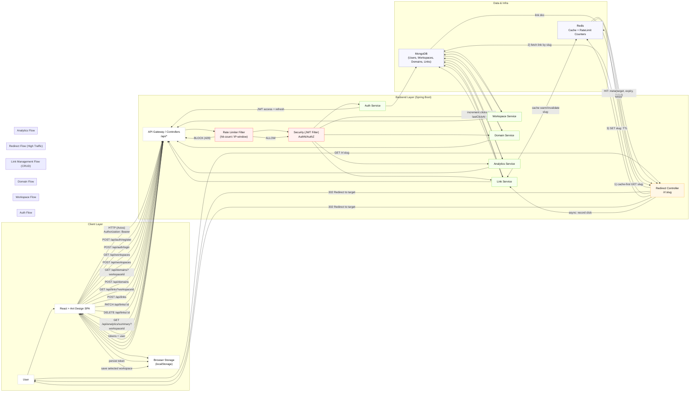

```mermaid

flowchart LR
  %% ========= Styles =========
  classDef box fill:#ffffff,stroke:#c8c8c8,stroke-width:1px,color:#111;
  classDef store fill:#f7f7ff,stroke:#8b8bd6,stroke-width:1px,color:#111;
  classDef svc fill:#f6ffed,stroke:#73d13d,stroke-width:1px,color:#111;
  classDef edge fill:#fff7e6,stroke:#ffa940,stroke-width:1px,color:#111;
  classDef sec fill:#fff1f0,stroke:#ff4d4f,stroke-width:1px,color:#111;

  %% ========= Client =========
  subgraph CLIENT["Client Layer"]
    U["User"]:::box
    FE["React + Ant Design SPA"]:::box
    LS["Browser Storage<br/>(localStorage)"]:::store
    U --> FE
    FE <--> LS
  end

  %% ========= Backend =========
  subgraph BACKEND["Backend Layer (Spring Boot)"]
    API["API Gateway / Controllers<br/>/api/*"]:::svc
    SEC["Security (JWT Filter)<br/>AuthN/AuthZ"]:::sec
    RL["Rate Limiter Filter<br/>(hit-count / IP-window)"]:::sec

    S_AUTH["Auth Service"]:::svc
    S_WS["Workspace Service"]:::svc
    S_DOM["Domain Service"]:::svc
    S_LINK["Link Service"]:::svc
    S_AN["Analytics Service"]:::svc

    REDIR["Redirect Controller<br/>/r/:slug"]:::edge
  end

  %% ========= Data =========
  subgraph DATA["Data & Infra"]
    MONGO["MongoDB<br/>(Users, Workspaces, Domains, Links)"]:::store
    REDIS["Redis<br/>Cache + RateLimit Counters"]:::store
  end

  %% ========= Global Request Entry =========
  FE -->|"HTTP (Axios)<br/>Authorization: Bearer <token>"| API
  API --> RL --> SEC

  %% ========= Auth Flows =========
  subgraph AUTHF["Auth Flow"]
    FE -->|"POST /api/auth/register"| API
    FE -->|"POST /api/auth/login"| API
    SEC --> S_AUTH --> MONGO
    S_AUTH -->|"JWT access + refresh"| API
    API -->|"tokens + user"| FE
    FE -->|"persist token"| LS
  end

  %% ========= Workspace Flows =========
  subgraph WSF["Workspace Flow"]
    FE -->|"GET /api/workspaces"| API
    FE -->|"POST /api/workspaces"| API
    SEC --> S_WS --> MONGO
    MONGO --> S_WS --> API --> FE
    FE -->|"save selected workspace"| LS
  end

  %% ========= Domain Flows =========
  subgraph DOMF["Domain Flow"]
    FE -->|"GET /api/domains?workspaceId"| API
    FE -->|"POST /api/domains"| API
    SEC --> S_DOM --> MONGO
    MONGO --> S_DOM --> API --> FE
  end

  %% ========= Link CRUD Flows =========
  subgraph LINKF["Link Management Flow (CRUD)"]
    FE -->|"GET /api/links?workspaceId"| API
    FE -->|"POST /api/links"| API
    FE -->|"PATCH /api/links/:id"| API
    FE -->|"DELETE /api/links/:id"| API

    SEC --> S_LINK --> MONGO
    S_LINK <-->|"cache warm/invalidate<br/>slug:<slug>"| REDIS
    MONGO --> S_LINK --> API --> FE
  end

  %% ========= Redirect / Short Link Flow =========
  subgraph REDF["Redirect Flow (High Traffic)"]
    U -->|"GET /r/:slug"| REDIR
    REDIR -->|"1) cache-first GET slug:<slug>"| REDIS

    REDIS -->|"HIT: meta(target, expiry, linkId)"| REDIR
    REDIR -->|"302 Redirect to target"| U

    REDIS -->|"MISS"| REDIR
    REDIR -->|"2) fetch link by slug"| MONGO
    MONGO -->|"link doc"| REDIR
    REDIR -->|"3) SET slug:<slug> TTL"| REDIS
    REDIR -->|"302 Redirect to target"| U

    %% click record
    REDIR -->|"async: record click"| S_LINK
    S_LINK -->|"increment clicks + lastClickAt"| MONGO
  end

  %% ========= Analytics Flow =========
  subgraph ANF["Analytics Flow"]
    FE -->|"GET /api/analytics/summary?workspaceId"| API
    SEC --> S_AN --> MONGO
    MONGO --> S_AN --> API --> FE
  end

  %% ========= Rate Limit Decision =========
  RL -->|"ALLOW"| SEC
  RL -->|"BLOCK (429)"| API

  %% ========= Class assignments (optional) =========
  class U,FE,API,LS box
  class MONGO,REDIS store
  class S_AUTH,S_WS,S_DOM,S_LINK,S_AN svc
  class REDIR edge
  class SEC,RL sec


```